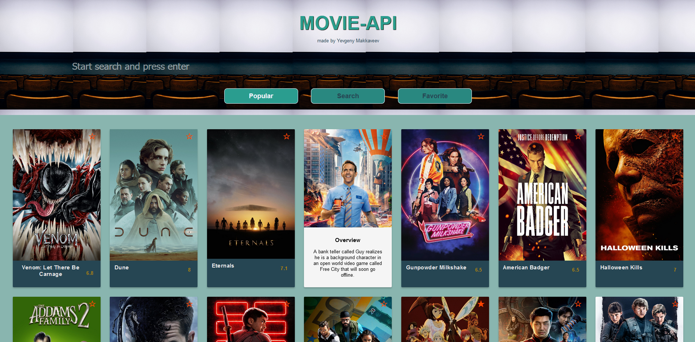
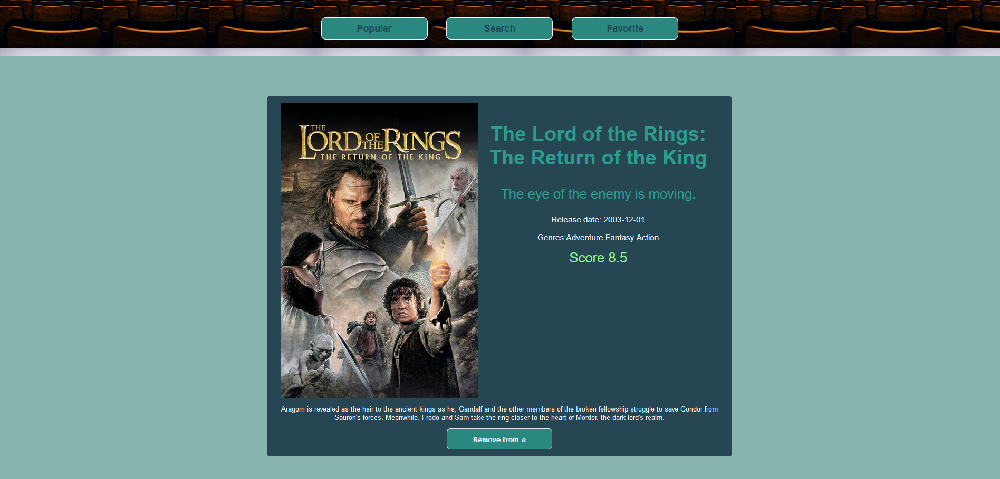
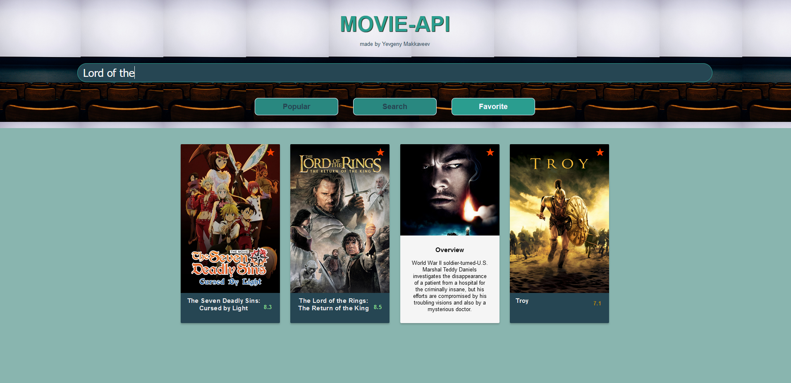

# Movie-API

Live demo here [link](https://boring-archimedes-34337d.netlify.app/)

For this app I use TypeScript, React, React-Router, Mobx, some jest tests and SASS. For an api request to [Movie-DB](https://www.themoviedb.org/) api I use axios (since you need to do several api calls and it make it a bit easier). You can search movies, look at the popular, and add them to the favorite from any screen. Favorite movies are saved in your local storage. It meant to be my final personal project in my [GNIVC](https://gnivc.ru/) Trainee program, to show what i learn there, but the group project need my attention too, so I make it later.

Для этого приложения я использовал TypeScript, React, React-Router, Mobx, Jest для юнит тестов и SASS для стайлинга. Для запросов к [Movie-DB](https://www.themoviedb.org/) использовал axios, который упрощает этот процесс, так как запросов нужно было сделать несколько. В нем можно смотреть на популярные фильмы, искать фильмы, а так же добавлять их в избранное, как с экрана результатов поиска, так и со страницы выбранного фильма. Избранные фильмы сохраняются в локальном хранилище. Это должно было стать моим финальным проектов во время стажировки в [ГНИВЦ](https://gnivc.ru/), но из-за группового проекта пришлось сделать более скромный финальный проект, и сделать это приложение уже после стажировки.